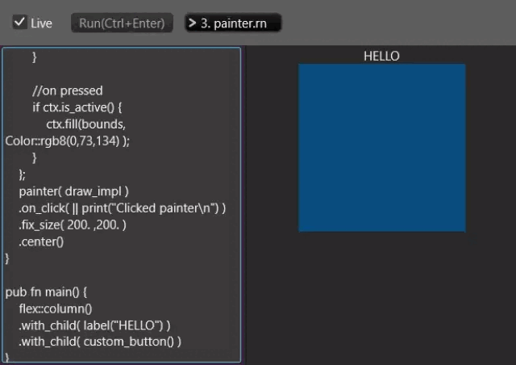

# What is this?
This is the tool for creation quick prototype druid ui.
It was created to save time designing the druid UI from the terrible rust compile time.

* Druid : https://linebender.org/druid/
* Rune : https://rune-rs.github.io/

This project is just personal experimental project(dirty code) and many things are not implemented yet.

# How to run
```
cargo run --release
```
**NOTE**: Run as debug mode is very slow. Also, I've only running on Windows, but I haven't been able to confirm it's running on Linux or Mac.

# Preview
* If enabled `Live` checkbox then script code compile immediately.
* Select the example rune script.




# Built-in rune module
Constant, Function, Type

## Constant
* [UnitPoint](https://docs.rs/druid/latest/druid/struct.UnitPoint.html)
### Flex
* [FlexParams](https://docs.rs/druid/latest/druid/widget/struct.FlexParams.html)
* [CrossAxisAlignment](https://docs.rs/druid/latest/druid/widget/enum.CrossAxisAlignment.html)
* [MainAxisAlignment](https://docs.rs/druid/latest/druid/widget/enum.MainAxisAlignment.html)
### Text
* [LineBreaking](https://docs.rs/druid/latest/druid/widget/enum.LineBreaking.html)
* [TextAlignment](https://docs.rs/druid/latest/druid/enum.TextAlignment.html)
### Image,Svg
* [FillStrat](https://docs.rs/druid/latest/druid/widget/enum.FillStrat.html)


## Function
* flex() or flex::row() : [Flex::row](https://docs.rs/druid/latest/druid/widget/struct.Flex.html#method.row)
* flex::column() : [Flex::column](https://docs.rs/druid/latest/druid/widget/struct.Flex.html#method.column)
* label(string) : [Label::new](https://docs.rs/druid/latest/druid/widget/struct.Label.html)
* button(string) : [Button::new](https://docs.rs/druid/latest/druid/widget/struct.Button.html)
* checkbox() : [Checkbox::new](https://docs.rs/druid/latest/druid/widget/struct.Checkbox.html)
* either(widget,widget) : [Either::new](https://docs.rs/druid/latest/druid/widget/struct.Either.html)
* progressbar : [ProgressBar::new](https://docs.rs/druid/latest/druid/widget/struct.ProgressBar.html)
* painter(fn) : [Painter::new](https://docs.rs/druid/latest/druid/widget/struct.Painter.html)
* list : [List::new](https://docs.rs/druid/latest/druid/widget/struct.List.html)
* radiogroup : [RadioGroup::new](https://docs.rs/druid/latest/druid/widget/struct.RadioGroup.html)
* slider : [Slider::new](https://docs.rs/druid/latest/druid/widget/struct.Slider.html)
* stepper : [Stepper::new](https://docs.rs/druid/latest/druid/widget/struct.Stepper.html)
* textbox : [TextBox::new](https://docs.rs/druid/latest/druid/widget/struct.TextBox.html)
* switch : [Switch::new](https://docs.rs/druid/latest/druid/widget/struct.Switch.html)
* spinner : [Spinner::new](https://docs.rs/druid/latest/druid/widget/struct.Spinner.html)
* image : [Image::new](https://docs.rs/druid/latest/druid/widget/struct.Image.html)
* svg : Svg::new

## TODO
### Shape
* ~~Circle~~
* ~~Line~~
* ~~RoundedRect~~
* ~~Rect~~
* PathSeg(Line,QuadBez,CubicBez)
* Arc
* BezPath
* CircleSegment
* CubicBez
* Ellipse
* QuadBez

### IntoBrush
* ~~Color~~
* FixedGradient(FixedLinearGradient,FixedRadialGradient)
* PaintBrush(Color,LinearGradient,RadialGradient,FixedGradient)
* LinearGradient
* RadialGradient

### Tool 
* Show compile error in UI
* Color picker shortcut